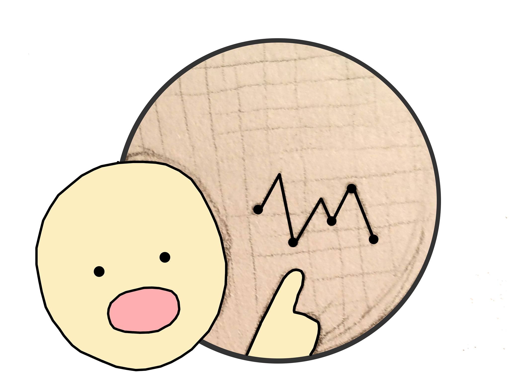

# GraphWhy 

GraphWhy is a free solution to the need for a good unrestrained survey provider.

## Getting Started

Following this section will get you up and running so you can see what we are working with. Hopefully you will decide to help the cause aswell!

### Prerequisites

Git -> https://git-scm.com/book/en/v2/Getting-Started-Installing-Git</br>
Or: ```sudo apt-get install git-all```</br>

Node ->  https://nodejs.org/en/download/package-manager/</br>
Or: ```curl -sL https://deb.nodesource.com/setup_6.x | sudo -E bash -
          sudo apt-get install -y nodejs```</br>
          
Bower -> http://bower.io/ </br>
Or:  ```sudo npm install -g bower```</br>

Grunt -> http://gruntjs.com/getting-started </br>
Or: ```sudo npm install -g grunt```

### Install
```
sudo git clone https://github.com/GraphWhy/graphwhyfrontend.git
cd graphwhyfrontend
sudo bower install --allow-root
sudo npm install
sudo grunt build
```
